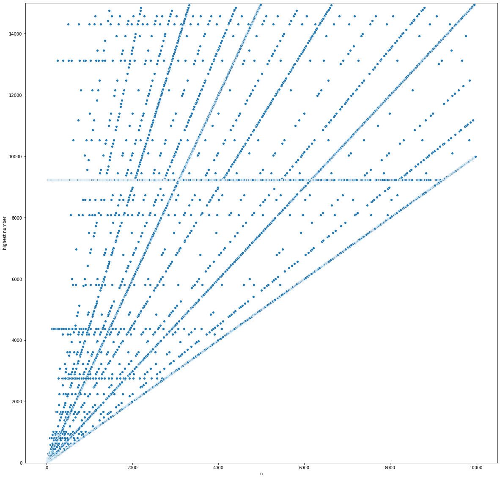

# Collatz conjecture

Visualization on the famous [3n+1 problem](https://en.wikipedia.org/wiki/Collatz_conjecture)

> The Collatz Conjecture states that if you pick a number, and if it's even divide it by two and if it's odd multiply it by three and add one, and you repeat this procedure long enough, eventually your friends will stop calling to see if you want to hang out. - XKCD#710

n from 1 - 1000000 and their stopping times

n from 1 - 10000 and their peaks

## References

- [XKCD](https://xkcd.com/710/)

